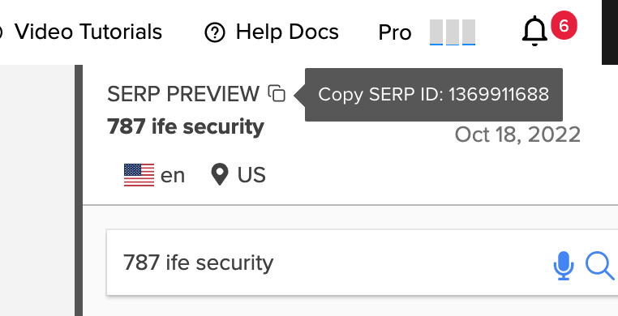

# SERPs

This section describes getting SERP data for a specified keyword result.

## Finding the SERP ID

You can copy the SERP ID from the top right corner of the keyword SERP Preview page in the Nightwatch app.  



## Get SERP Data

```shell
curl 'https://api.nightwatch.io/api/v1/serp_data/RESULT_ID?access_token=ACCESS_TOKEN'
```

> The above command returns JSON structured like this:

```json
{
  "keyword":"example",
  "engine":"google",
  "rank_time":"2019-08-25T03:11:51.614409Z",
  "rank_date":"2019-08-25",
  "locale":"en",
  "data_center":"us",
  "location":"New York, New York, United States",
  "total_number_of_results":160000,
  "serp":{
    "1":{
      "title":"Example #1",
      "href":"https://test.example.com/page/1",
      "description":"This is the first example",
      "base_url":"test.example.com",
      "base_domain":"example.com",
      "position":1
    },
    "2":{
      "title":"Example #2",
      "href":"https://www.example.com/2",
      "description":"This is the second example",
      "base_url":"www.example.com",
      "base_domain":"example.com",
      "position":2
    },
    // ...
    // result slots can be null if they're
    // missing (e.g. less than 100 results)
    "100":null
  },
  "local_pack":{
    "results":[
      {
        "title":"Local result",
        "cid": "1234567890",
        "href":"https://www.example.com/local"
      }
    ],
    "present":true
  },
  "local_image_carousel":{
    "results":[
      {
        "title":"Local result"
      }
    ],
    "present":true
  },
  "knowledge_panel":{
    "results":[
      {
        "title":"Knowledge panel result",
        "cid": "1234567890",
        "href":"https://www.example.com/knowledge-panel"
      }
    ],
    "present":true
  },
  "featured_snippets":{
    "results":[
      {
        "title":"Featured snippet result",
        "href":"https://www.example.com/snippet"
      }
    ],
    "present":true
  }
}
```

### HTTP Request

`GET https://api.nightwatch.io/api/v1/serp_data/RESULT_ID?access_token=ACCESS_TOKEN`

Response structure:

| Attribute               | Description                                                      |
|-------------------------|------------------------------------------------------------------|
| keyword                 | Keyword query string                                             |
| engine                  | Search engine (google, places, bing, yahoo, duckduckgo, youtube) |
| rank_time               | The time the SERP was processed                                  |
| rank_date               | The date the SERP was processed                                  |
| locale                  | Requested search language (e.g. en)                              |
| data_center             | Requested search country (e.g. us)                               |
| location                | Search location (e.g. New York, New York, United States)         |
| total_number_of_results | The total number of search results                               |
| serp                    | A JSON object of ranked organic results                          |
| local_pack              | A JSON object containing a list of local pack results            |
| local_image_carousel    | A JSON object containing a list of carousel results              |
| knowledge_panel         | A JSON object containing a list of knowledge panel results       |
| featured_snippets       | A JSON object containing a list of featured snippet results      |
